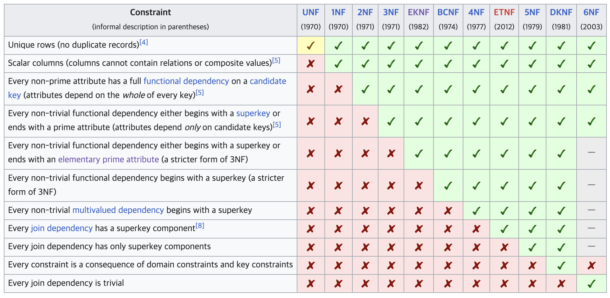
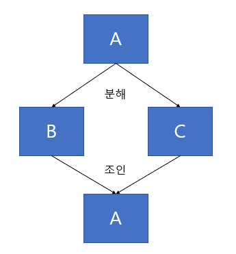
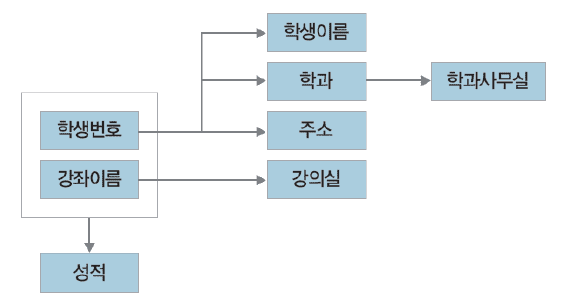
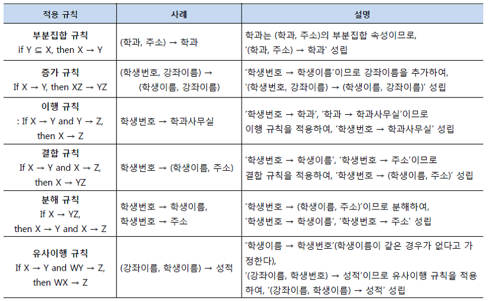

# 정규화
- 하나의 릴레이션에 하나의 의미만 존재하도록 릴레이션을 분해하는 과정
- 데이터의 일관성, 최소한의 데이터 중복, 최대한의 데이터 유연성을 위한 방법

### 이상현상(Anomaly)
- 정규화를 거치지 않은 데이터베이스에서 발생할 수 있는 현상
- 데이터들이 불필요하게 중복되어 릴레이션 조작에 예기치 못한 문제 발생
- 어트리뷰트들의 종속관계를 하나의 릴레이션에 표한하기 때문에 발생
- 종류
  - 삽입 이상: 자료를 삽입할 때 의도하지 않은 자료까지 삽입해야만 자료를 테이블에 추가가 가능한 현상(NULL 을 입력해야 하는 현상)
  - 갱신 이상: 중복된 데이터 중 일부만 수정되어 데이터 불일치가 일어나는 현상
  - 삭제 이상: 어떤 정보를 삭제하면, 의도하지 않은 다른 정보까지 삭제되 어버리는 현상


<details>
<summary> 정리내용 </summary>

# 정규화
- 이상현상이 있는 릴레이션을 분해하여 이상현상을 없애는 과정
- 이상현상이 존재하는 릴레이션을 분해하여 여러개의 릴레이션을 생성하여 정규형이 높아질 수록 이상현상은 줄어들게 됨
- 쉽게 말해 테이블 간에 중복된 데이터를 허용하지 않는 것. (무결성(Integrity) 보장)

## 정규화 목적
- 중복을 배제하여 삽입, 삭제, 갱신 이상의 발생을 방지
- 각 릴레이션에 중복된 종속성을 여러개의 릴레이션에 분할
- 어떤한 릴레이션이라도 데이터베이스 내에서 표현 가능하게 함
- 데이터 삽입 시 릴레이션을 재구성할 필요성 감소
- 효과적인 검색 알고리즘 생성 가능

## 정규화 장/단점
### 장점
- 데이터베이스 변경 시 이상 현상(Anomaly)을 제거할 수 있다
- 정규화된 데이터베이스 구조에서는 새로운 데이터 형의 추가로 인한 확장 시, 그 구조를 변경하지 않아도 되거나 일부만 변경해도 된다
- 데이터베이스와 연동된 응용 프로그램에 최소한의 영향만을 미치게 되어 응용프로그램의 생명을 연장 시킨다.
### 단점
- 릴레이션의 분해로 인해 릴레이션간 JOIN연산이 많아짐
- 데이터의 중복 속성을 제거하고 결정자에 의해 동일한 의미의 일반 속성이 하나의 테이블로 집약되므로 한테이블의 데이터 용량이 최소화 되는 경향이 있음 -> 데이터 처리 시 속도가 빨라질 수도 있고 느려질 수도 있음.


## 정규화 과정
<p align="center"></p>

### 1NF
- 각 컬럼이 원자값(Atomic Value, 하나의 값)을 갖도록 테이블을 분해하는 것
- 각 컬럼은 같은 종류나 타입(type)의 값을 가져야 한다.
- 각 컬럼이 유일한(unique) 이름을 가져야 한다.
- 컬럼의 순서가 상관없어야 한다.
### 2NF
- 1NF를 진행한 테이블에 대해 완전 함수 종속을 만족하도록 테이블을 분해하는 것
- 완전함수종속: 기본키의 부분집합이 결정자가 되어선 안되는 것
### 3NF
- 2NF를 진행한 테이블에 대해 이행적 종속을 없애도록 테이블은 분해하는 것
- 이행적 종속: A -> B, B -> C 가 성립할 때, A -> C가 성립되는 것
### EKNF
- EKNF(기본 키 정규형)는 세 번째 정규형을 약간 개선한 것.
- EKNF 테이블은 정의상 3NF입니다. 
- 3NF보단 엄격하고, BCNF보단 관대한? 정규화
- 거의 언급되는 곳이 없고..사용되는 곳도 없어보인다
### BCNF
- 3NF를 진행한 테이블에 대해 모든 결정자가 후보키가 되도록 테이블은 분해하는 것
--- 
> 보통 정규화는 **BCNF** 까지 진행하는 경우가 많다. 그 이상 정규화를 하면 정규화의 단점이 발생할 수 있음.

### 4NF
- BCNF를 진행한 테이블에 다치 종속(Multi-valued Dependency)이 없어야 한다.
- 다치 종속조건
```
- A -> B일 때 하나의 A값에 여러 개의 B값이 존재하면 다치 종속성을 가진다고 하고 A ->> B로 표시한다
- 최소 3개 이상 컬럼이 존재한다
- R(A, B, C)가 있을 때 A와 B사이에 다치 종속석이 있으면 B와 C가 독립적이다
```
### ETNF
- 모든 조인 종속성에 슈퍼키 구성 요소가 존재
### 5NF(PJNF)
- 중복을 제거하기 위해 분해할 수 없을 만큼 전부 분해하는 것
- PJNF(Project Join Normal Form)라고도 함
- 4NF를 진행한 테이블에 조인종속이 없어야 하고, 조인연산시 손실이 없어야 한다.
- 조인종속: 다치 종속의 좀 더 일반화된 형태. 하나의 릴레이션을 여러 개의 릴레이션으로 무손실 분해했다가 다시 결합할 수 있다면 조인 종속이 있다고 할 수 있다.
<p align="center"></p>

- 일반적으로 현실의 데이터베이스에서는 5NF를 사용하지 않음. 
### DKNF
- 모든 가능한 종류의 종속성과 제약조건을 고료하는 궁극적 정규형을 정의하는 것이 목적.
- 도메인 제약 조건 및 키 제약 조건 이외의 다른 제약 조건이 없음
### 6NF
- 사소한 조인 종속성만 충족

3NF이후의 정규형은..주로 학술용으로 사용되는 듯 하다.

### 이상현상(Anomaly)
- 정규화를 거치지 않은 데이터베이스에서 발생할 수 있는 현상
- 데이터들이 불필요하게 중복되어 릴레이션 조작에 예기치 못한 문제 발생
- 어트리뷰트들의 종속관계를 하나의 릴레이션에 표한하기 때문에 발생
- 종류
  - 삽입 이상: 자료를 삽입할 때 의도하지 않은 자료까지 삽입해야만 자료를 테이블에 추가가 가능한 현상(NULL 을 입력해야 하는 현상)
  - 갱신 이상: 중복된 데이터 중 일부만 수정되어 데이터 불일치가 일어나는 현상
  - 삭제 이상: 어떤 정보를 삭제하면, 의도하지 않은 다른 정보까지 삭제되 어버리는 현상

### 함수종속성(FD: Functional Dependency)
- 어떤 속성 A의 값을 알면 다른 속성 B의 값이 유일하게 정해지는 관계를 종속성이라고 함
- A->B로 표기하고 **A를 B의 결정자(Determinant)** 라고 한다
- A->B이면 **A는 B를 결정한다(Determine)** 한다고 하고, **B는 A에 종속한다(Dependent)** 라고 한다.

- 함수 종속성 규칙
<p align="center"></p>
<p align="center"></p>

</details>