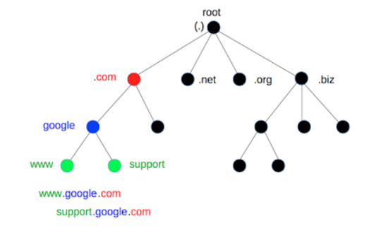

## DNS(Domain Name System)
- 통신을 하기 위해선 ip 주소가 필요함.
- 비교적 사람이 기억하기 쉬운 문자열을 ip주소로 변환해주거나 혹은 반대의 역할을 수행하는 시스템
  - ex) google.com -> 216.58.200.238

### 동작방식
1. 기본적으로 local에 저장되어 있는 정보를 참고(hosts 파일)
2. hosts파일에 정보가 없다면 설정된 name server에 질의(보통 ISP 업체의 name server 사용)
3. 2번 단계에서도 ip주소를 얻지 못했다면 각 DNS서버 마다 설정된 Root DNS 서버에 질의함.
> Root DNS 서버는 TLD(Top-Level Domain) DNS 서버 IP들을 저장하고 안내하는 역할
4. TLD DNS 서버에서 부터 ip주소를 찾을 때 까지 단계적으로 내려가면서 해당 네임서버에 질의

> TLD DNS 서버
> - 도메인에서 가장 오른쪽 레이블이 최상위 도메인을 의미한다. 
> - 도메인은 계층 구조로 오른쪽부터 왼쪽으로 계층이 내려감.(왼쪽이 오른쪽의 서브 도메인)

