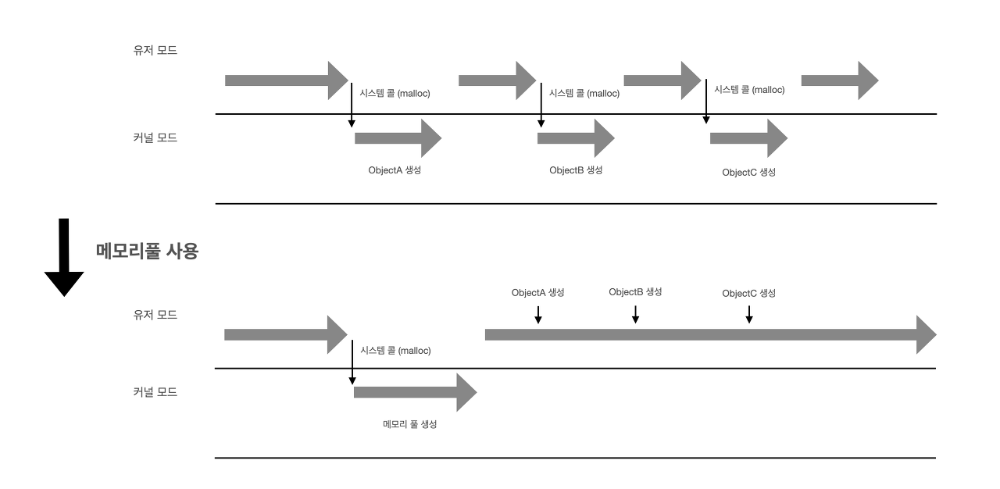

## 메모리 단편화
- CPU에서 처리하기 위한 프로세스들을 메모리에 적재/제거 하는 과정이 반복되면서 사용가능한 메모리가 충분하지만 할당(사용)이 불가능한 상태
- 단편화로 일어날 수 있는 현상
    - 총 메모리 공간은 충분하지만 실제 사용이 불가능할 수 있다
    - 실제 사용 가능 공간이 줄어들어 **성능저하**를 일으킬 수 있다.
        - 실제 사용할 수 있는 공관을 찾는 과정 필요
        - 잦은 페이지 교체
        - swapping
> 메모리 할당 방법  
>- First-fit  
>    - 가장 처음 보이는 빈 공간에 할당
>- Best-fit  
>    - 가장 잘 맞는 공간에 할당. 모든 빈공간을 게산 했을 때, 프로세스 할당 후 가장 남는 공간이 적은 공간에 할당
>- Worst-fit
>    - 가장 큰 빈공간에 할당

### 내부 단편화
- 메모리 할당 시 프로세스가 필요한 양보다 더 큰 메모리가 할당외어 메모리 공간이 낭비되는 상황
- 예를 들어 메모장을 사용할 때 OS가 10kb 할당하였으나, 7kb만 사용될 때 -> 내부 단편화 3kb 만큼 생김
### 외부 단편화
- 메모리 할당/해제 작업의 반복으로 작은 메모리가 중간중간 존재하게 되고, 이 때 생긴 사용하지 않는 메모리가 많이 존재해서 총 메모리 공간은 충분하지만 실제로 할당이 불가능한 상황
- 여러 공간이 여러 조각으로 나뉘는 현상

## 해결방법
### 압축
- 메모리 공간을 재배치하여 단편화로 인해 분산되어 있는 메모리 공간들을 하나로 합치는 기법
- ex) 디스크 조각모음

### 통합
- 단편화로 인해 분산되 메모리 공간들을 인접해 있는 것끼리 통합시켜 큰 메모리 공간으로 합치는 기법
- 압축은 재배치 되는 것이고, 통합은 인접 공간끼리 통합된다.

### 페이징
- 사용하지 않는 프레임을 페이지에 옮기고, 필요한 메모리를 페이지 단위로 프레임에 옮기는 방법
    - 페이지: 가상메모리를 같은 크기의 블록으로 나눈 것
    - 프레임: 주기억장치를 페이지와 같은 크기로 나눈 것
- 페이지와 프레임을 매핑하는 과정이 필요하기 때문에 페이징 테이블이 필요하다.
- 연속적이지 않는 공간을 활용할 수 있기 때문에 외부 단편화 문제를 해결할 수 있으나, 페이지 단위에 꽉 채워쓰는게 아니므로 내부 단편화문제가 여전히 존재
- 페이지 단위를 작게하면 내부 단편화 문제도 해결할 수 있지만, 대신 페이지 매핑 과정이 많아져 오히려 효율이 떨어질 수 있다.
- 페이지의 크기를 결정하는 기준
    - 내부 단편화
    - Page-in, Page-out 시간 - I/O Overhead
    - 페이지 테이블 크기
    - 메모리 해상도(Memory resolution) - 필요한 내용만 메모리에 담을 수 있는 정도
    - 페이지 부재(Page Fault) 발생 확률
- 페이지 크기가 작을 수록 좋은 기준
    - 내부 단편화 - 페이지가 작을 수록 버려지는 메모리의 내부 공간(내부 단편화)도 작아짐
    - 메모리 해상도 - 페이지가 크면 불필요한 영역까지 함께 적재될 수 밖에 없다. 반대로 적을 수록 필요한 부분만 메모리에 적재되는 정밀도가 증가한다
- 페이지 크기가 클 수록 좋은 기준
    - Page-in, Page-out 시간 - I/O 시간은 대부분 디스크의 헤드 이동시간이다. 페이지가 클 수록 이동 한 번으로 많은 데이터를 읽어올 수 있는 장점
    - Page Table Size - 페이지의 크기가 클 수록 테이블의 row 수는 적어지게 됨
    - Page Fault 발생확률 - 페이지가 클 수록하나의 페이지 내에 많은 내용을 담고 있기 때문에 페이지 재사용 가능성이 높게 되고 메모리 지역성에 의해 페이지 부재도 덜 발생하게 됨

### 세그멘테이션
- 가상 메모리를 서로 크기가 다른 논리적 단위인 세그먼트로 분할하고 메모리를 할당하여 실제 메모리 주소로 변환 하는 방법
- 각 세그먼트는 연속적인 공간에 저장되어 있음
- 세그먼트들의 크기가 다르기 때문에 미리 분할해 둘 수 없고, 메모리에 적재될 때 빈 공간을 찾아 할당하는 방법
- 세그먼트와 메모리주소를 매핑하는 세그멘테이션 테이블이 필요 -> 각 세그먼트의 시작 주소와 크기 정보
- 프로세스가 필요한 메모리만큼 할당해주기 때문에 내부 단편화는 일어나지 않으나 여전히 중간에 프로세스가 메모리를 해제하면 생기는 구멍(hole), 즉 외부 단편화 문제는 여전히 존재

### 메모리 풀
- 필요한 메모리 공간을 필요한 크기, 개수만큼 사용자가 직접 지정하여 미리 할당받아놓고 필요할 때마다 사용하고 반납하는 방법.
- 미리 공간을 할당해놓고 할당/해제 하기 때문에 할당/해제로 인한 외부 단편화는 발생하지 않음, 또한 필요한 크기만큼 할당을 해놓기 때문에 내부 단편화가 발생하지 않음.
- 메모리의 할당/해제가 잦은 경우 사용하면 효율적이나, 미리 할당해놓고 사용하지 않는 경우에는 메모리가 계속 할당되어 있기 때문에 메모리 낭비(누수)가 심함
- 메모리 할당 및 해제를 위해서는 시스템 콜(System Call)이 필요함. 시스템 콜은 유저 모드에서 작업을 하는 것보다 더 많은 리소스를 필요로 하는데, 메모리 풀을 사용하게 되면 유저 코스트로 객체를 생성할 수 있어 성능적인 이점을 얻을 수 있다.
    - malloc을 사용해 생성된 객체들은 각각 따로 해제해주어야 하는데, 메모리 풀을 사용한 경우 메모리 해제를 단 번에 할 수 있음.
    - 할 번에 할당받은 메모리 내에서 객체를 생성하기 때문에 객체를 생성할 때마다 malloc을 호출할 필요가 없어진다
    

> 구현방법  
  > - 큰 메모리 블록(페이지)을 힙으로 부터 할당
  > - 할당 받은 페이지를 각 객체의 크기의 블록으로 나눔
  > - 각 객체를 위한 블록을 순차적으로 링크
  > - 이 때 현 시점에서 할당할 블록을 특정 포인터가 가르키게 함
  > - 메모리 요청이 생기면 현재 헤더 포인터가 가리키는 블록을 돌려줌
  > - 할당이 일어난 후 헤더 포인터는 할당 직전에 가리키던 블록이 가리키던 블록을 가리킨다
  > - 사용되던 메모리가 해제되어 메모리 풀로 돌아올 경우 헤더 포인터는 그 블록을 가르키고 방금 전까지 헤더 포인터가 가리키던 블록을 돌아온 블록의 다음 포인터가 가리키게 한다
>> 연관정보: 캐시메모리 <!-- TODO -->